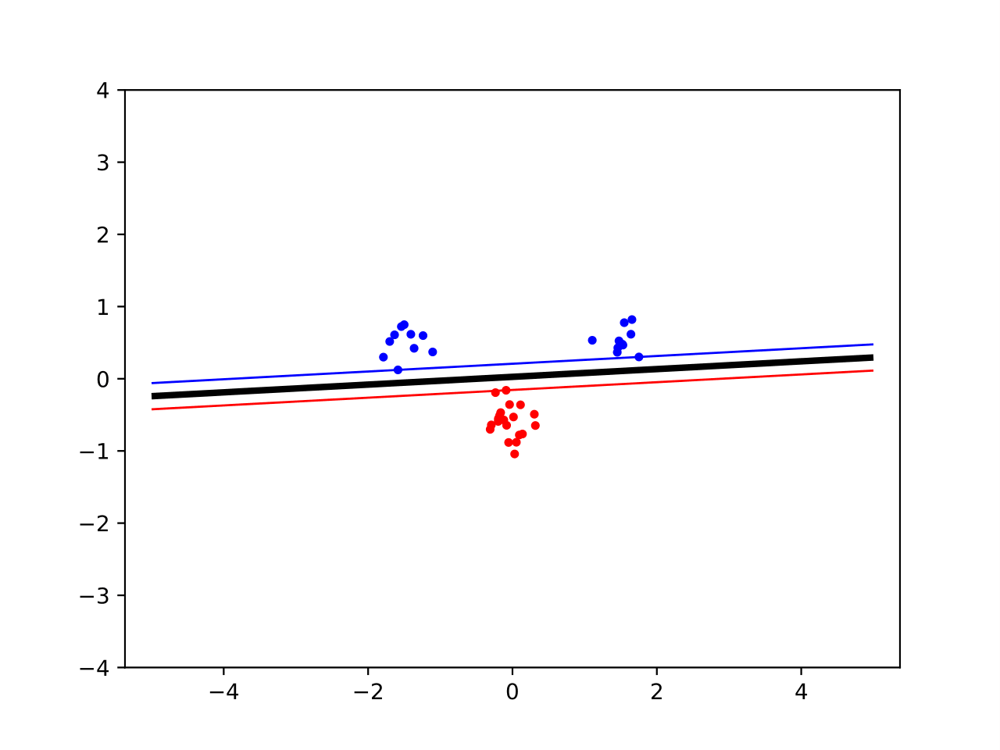
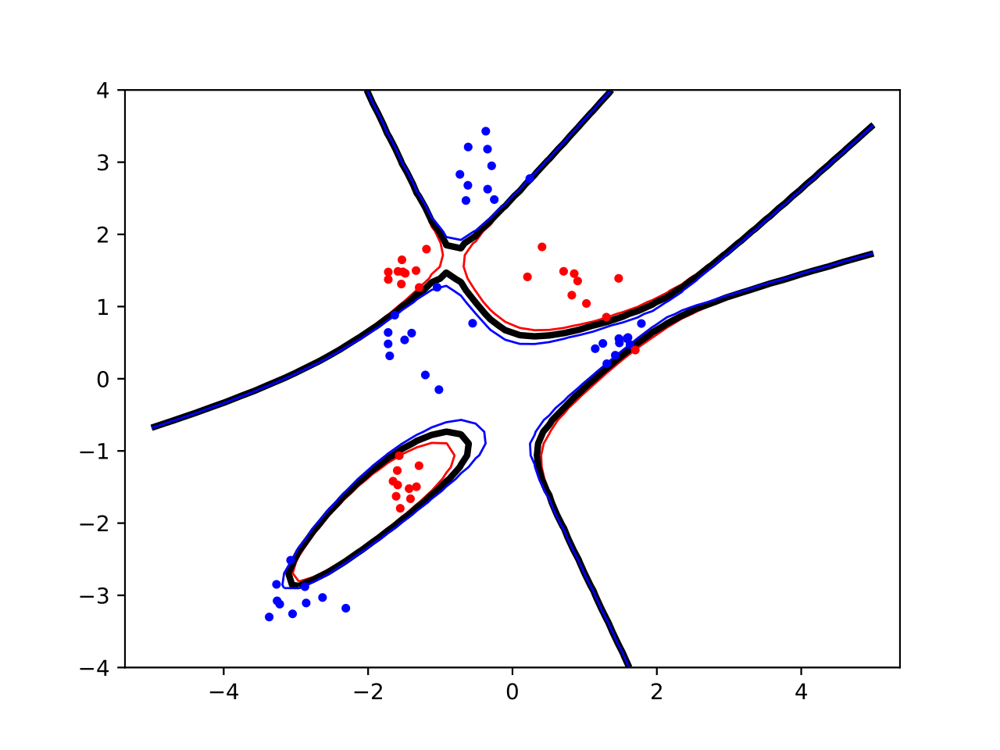
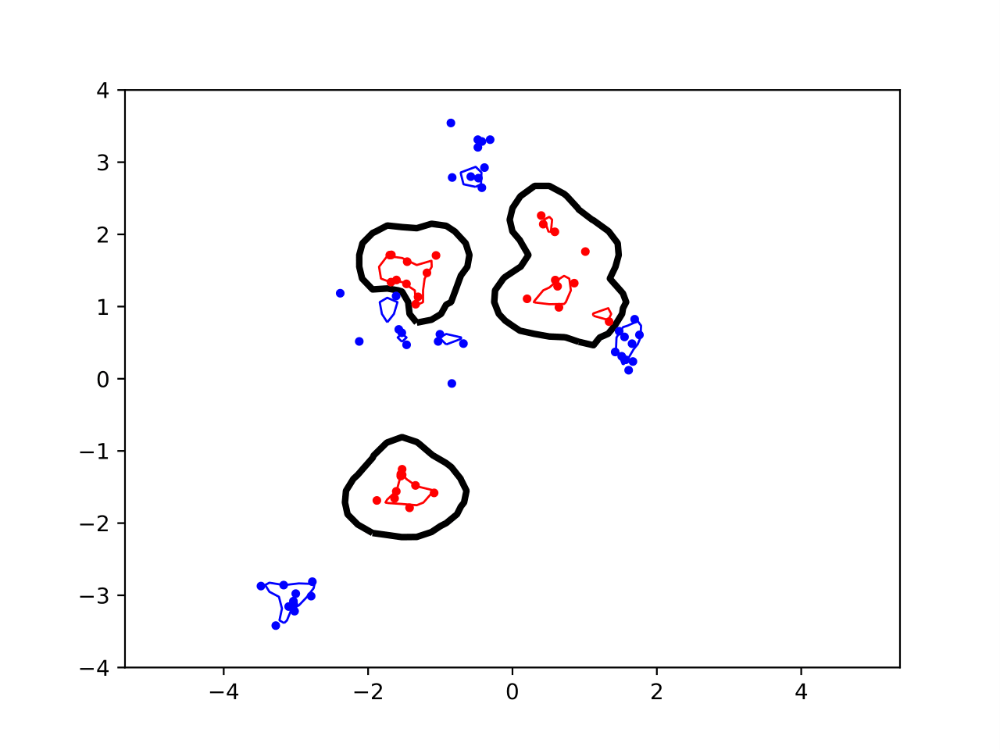

# SVM
This lab code basic Support Vector Machines with Python.

Here is an example of the plots that classify data with three different kernels (linear, polynomial, RBF).

  
  &nbsp; &nbsp; &nbsp;
  
  &nbsp; &nbsp; &nbsp;
  

## How does it work ?
Open the directory using the terminal, then run [main.py](main.py) using the command `python main.py`.
The plot will be displayed and save into the project folder as "svmplot.pdf". The PDF file is overwrited at every run. To save a plot PDF, just change its name, or move it to another directory.

Read through the code to change some parameters. Try to change the kernel (initially linear), the kernel degrees, or the data points. Some indications are given by the comments.

## Python and libraries
This project was done using Python 3.7.16.
Libraries needed: numpy, scipy, sklearn, seaborn, jupyter, matplotlib, pyqt.

## Collaborators
I had this lab with one classmate.

## License
[MIT License](LICENSE)
